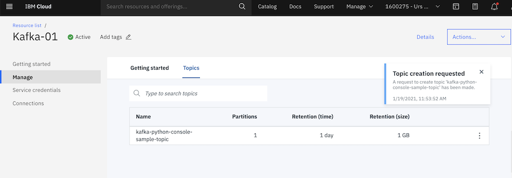
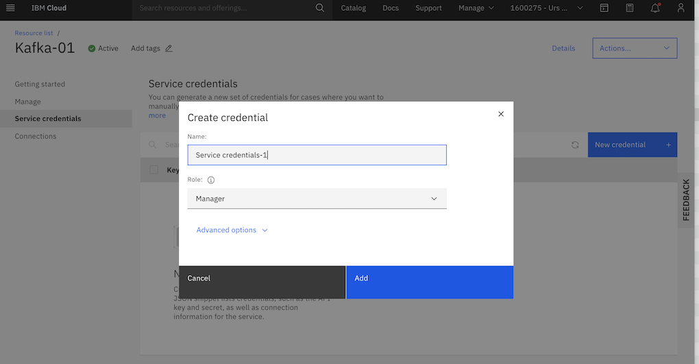
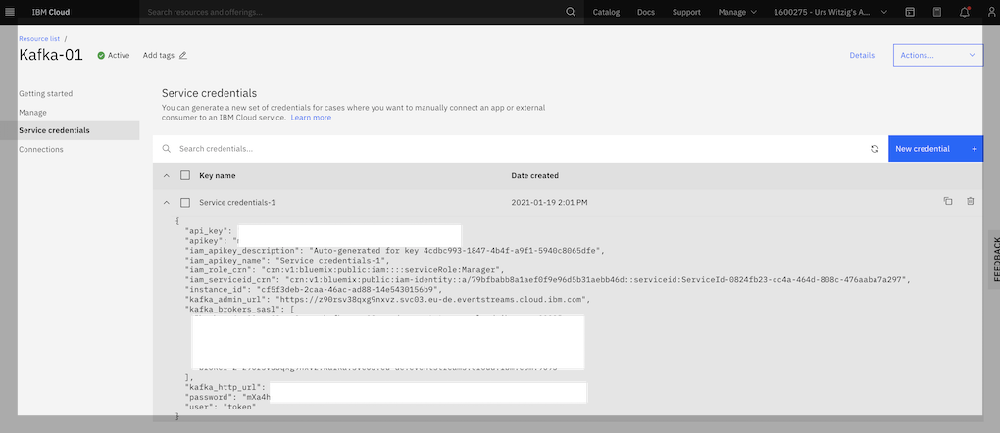
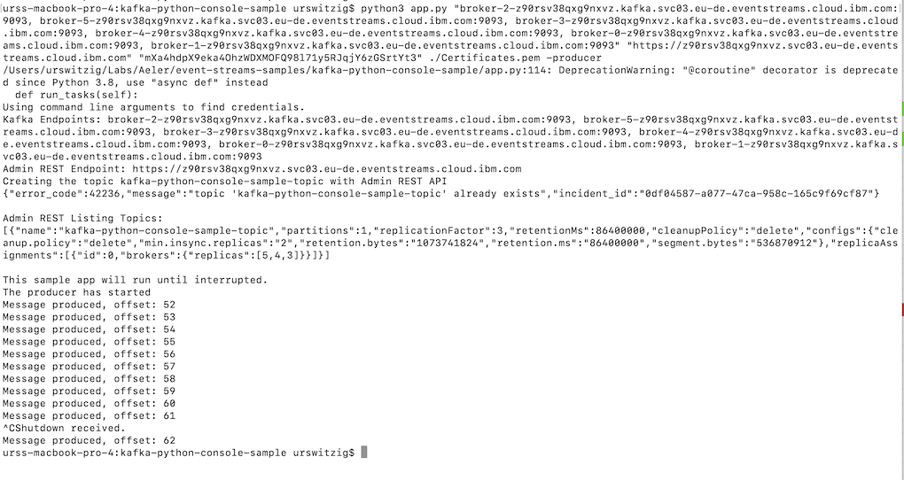

<h1 align="center" style="border-bottom: none;">:rocket: IBM Cloud Tutorial: Kafka and functions</h1>

In this hands-on tutorial you will create an IBM Event Streams Service on the IBM Cloud and run the sample application to produce events on the topic "kafka-python-console-sample-topic". Using IBM functions you create a trigger that invokes the write function every time an event arrives in the topic "kafka-python-console-sample-topic".

## Tutorial Overview


## Prerequisites

1. Sign up for an [IBM Cloud account](https://cloud.ibm.com/registration).
2. Fill in the required information and press the „Create Account“ button.
3. After you submit your registration, you will receive an e-mail from the IBM Cloud team with details about your account. In this e-mail, you will need to click the link provided to confirm your registration.
4. Now you should be able to login to your new IBM Cloud account ;-) 

## Create and configure Event Streams Service on the IBM Cloud

<h4>1) Create a Event Streams Service</h4>
After the login you will see your IBM Cloud Dashboard. In the upper right click on blue area "Create Resource". 
Type "Event Streams" in the search field of the catalog, then click on Event Streams. 
On the Event Streams page select the Standard plan, choose a region where you would like to deploy your service as well as a service name. 
Then click "Create".
<br>


<br>
<h4>2) Access your Event Streams Service</h4>
Go back to your IBM Cloud Dashboard by clicking the IBM Cloud Logo on the upper left. Under services you will find the Event Streams Service in the corresponding region. Access your service by clicking on its name.
<br>


<h4>3) Create a topic for your sample application</h4>

The next step is to create a topic where your sample application can write to. On the manage page of your Event Streams service click on "Topics", then click on "Create topic +"
<br>
Type "kafka-python-console-sample-topic" as this is the topic used by the sample event streams application and click on "Next".
<br>


On the next pages leave the values to its default and click on "Next" and finally on "Create topic". As a result your newly created topic will be displayed.
<br>



<h4>4) Add service credentials</h4>

An application can only access the service via its service credentials. Therefore we need to add service credentials as follows:

<ul>
  <li>Click on "Service credentials" on the left side on the Event Streams page.</li>
  <li>Then click on "New credential +" on the upper right side.</li>
  <li>Leave the service name to its default value and the role to "Manager" and click on "Add"</li>
</ul>



<br>
<ul>
  <li>Click **View credentials** to see the `api_key` and `kafka_brokers_sasl` values.</li>
</ul>



## Get and configure python sample application

IBM Event Streams Service is a high-throughput message bus built with Apache Kafka. To get started with Event Streams
and start sending and receiving messages, you can use the IBM Event Streams sample application.

<h4>1) Get prerequisites</h4>

Install [git](https://git-scm.com/) if you don't already have it.
<br>
Install [Python](https://www.python.org/downloads/) 3.6 or later

##### To run the application locally on macOS 
* Open Keychain Access, export all certificates in System Roots to a single .pem file on your local machine

<h4>2) Clone the Github repository for the sample application</h4>

   The sample application is stored in Github. Clone the `event-streams-samples` repository by running the clone command from the command line. 

   ```shell
   git clone https://github.com/ibm-messaging/event-streams-samples.git
   ```

   <br/>
   When the repository is cloned, from the command line change into the <code>kafka-python-console-sample</code> directory.

   ```shell
   cd event-streams-samples/kafka-python-console-sample/
   ```

<h4>3) Installing dependencies</h4>
Run the following command on your local machine to install the dependencies:

```shell
pip install -r requirements.txt
```

<h4>4) Running the sample app to produce messages</h4>

To run the producer sample, execute the following command:

```shell
python3 app.py <kafka_brokers_sasl> <kafka_admin_url> <api_key> <ca_location> -producer
```
   
 To find the values for `<kafka_brokers_sasl>`, `<kafka_admin_url>` and `<api_key>`, access your Event Streams instance in IBM Cloud®, go to the `Service Credentials` tab and select the `Credentials` you want to use.

`<ca_location>` is the path where the trusted SSL certificates are stored on your machine and is therefore system dependent. 

For example:
* Ubuntu: /etc/ssl/certs
* RedHat: /etc/pki/tls/cert.pem
* macOS: The .pem file you created in the prerequisite section

__Note__: `<kafka_brokers_sasl>` must be a single string enclosed in quotes. For example: `"host1:port1,host2:port2"`. We recommend using all the Kafka hosts listed in the `Credentials` you selected.

The sample will run indefinitely until interrupted. To stop the process, use `Ctrl+C`. 

Procuder app example console output on macOS:


__Note__: The service credentials have been removed after this tutorial. Therefore the api_key in the example above is not anymore valid.
  
<h4>5) Running the sample app to consume messages</h4>

To run the consumer sample open a second command line window and execute the following command:

```shell
python3 app.py <kafka_brokers_sasl> <kafka_admin_url> <api_key> <ca_location> -consumer
```
The sample will run indefinitely until interrupted. To stop the process, use `Ctrl+C`. 

Consumer app example console output on macOS:


__Note__: The service credentials have been removed after this tutorial. Therefore the api_key in the example above is not anymore valid.


## Get and configure IBM Cloud Function to comsume messages

<h4>1)Go to Cloud Functions and check your current namespace</h4>

1. Go to [IBM Cloud Functions](https://cloud.ibm.com/functions/) and check your current namespace


Please note you current namespace which is displayed after "Current namespace:"


