<h1 align="center" style="border-bottom: none;">:rocket: IBM Cloud Tutorial: Kafka and functions</h1>

In this hands-on tutorial you will create an IBM Event Streams Service on the IBM Cloud and run the sample application to produce events on the topic "kafka-python-console-sample-topic". Using IBM functions you create a trigger that invokes the write function every time an event arrives in the topic "kafka-python-console-sample-topic".

## Tutorial Overview

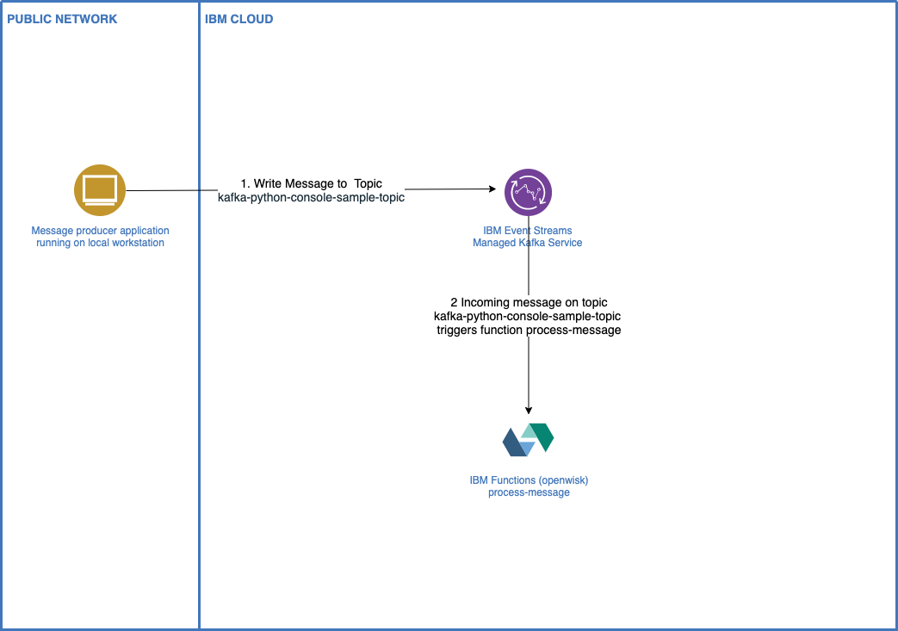


## Prerequisites

1. Sign up for an [IBM Cloud account](https://cloud.ibm.com/registration).
2. Fill in the required information and press the „Create Account“ button.
3. After you submit your registration, you will receive an e-mail from the IBM Cloud team with details about your account. In this e-mail, you will need to click the link provided to confirm your registration.
4. Now you should be able to login to your new IBM Cloud account ;-) 

## Create and configure Event Streams Service on the IBM Cloud

<h4>Task 1) Create a Event Streams Service</h4>
After the login you will see your IBM Cloud Dashboard. In the upper right click on blue area "Create Resource". 
Type "Event Streams" in the search field of the catalog, then click on Event Streams. 
On the Event Streams page select the Standard plan, choose a region where you would like to deploy your service as well as a service name. 
Then click "Create".
<br>


<br>
<h4>Task 2) Access your Event Streams Service</h4>
Go back to your IBM Cloud Dashboard by clicking the IBM Cloud Logo on the upper left. Under services you will find the Event Streams Service in the corresponding region. Access your service by clicking on its name.
<br>


<h4>Task 3) Create a topic for your sample application</h4>

The next step is to create a topic where your sample application can write to. On the manage page of your Event Streams service click on "Topics", then click on "Create topic +"
<br>
Type "kafka-python-console-sample-topic" as this is the topic used by the sample event streams application and click on "Next".
<br>


On the next pages leave the values to its default and click on "Next" and finally on "Create topic". As a result your newly created topic will be displayed.
<br>


<h4>Task 4) Add service credentials</h4>

An application can only access the service via its service credentials. Therefore we need to add service credentials as follows:

<ul>
  <li>Click on "Service credentials" on the left side on the Event Streams page.</li>
  <li>Then click on "New credential +" on the upper right side.</li>
  <li>Leave the service name to its default value and the role to "Manager" and click on "Add"</li>
</ul>


<br>
<ul>
  <li>Click **View credentials** to see the `api_key` and `kafka_brokers_sasl` values.</li>
</ul>


## Get and configure python sample application

IBM Event Streams Service is a high-throughput message bus built with Apache Kafka. To get started with Event Streams
and start sending and receiving messages, you can use the IBM Event Streams sample application.

<h4>Task 5) Get prerequisites</h4>

Install [git](https://git-scm.com/) if you don't already have it.
<br>
Install [Python](https://www.python.org/downloads/) 3.6 or later

##### To run the application locally on macOS 
* Open Keychain Access, export all certificates in System Roots to a single .pem file on your local machine

<h4>Task 6) Clone the Github repository for the sample application</h4>

   The sample application is stored in Github. Clone the `event-streams-samples` repository by running the clone command from the command line. 

   ```shell
   git clone https://github.com/ibm-messaging/event-streams-samples.git
   ```

   <br/>
   When the repository is cloned, from the command line change into the <code>kafka-python-console-sample</code> directory.

   ```shell
   cd event-streams-samples/kafka-python-console-sample/
   ```

<h4>Task 7) Installing dependencies</h4>
Run the following command on your local machine to install the dependencies:

```shell
pip install -r requirements.txt
```

<h4>Task 8) Running the sample app to produce messages</h4>

To run the producer sample, execute the following command:

```shell
python3 app.py <kafka_brokers_sasl> <kafka_admin_url> <api_key> <ca_location> -producer
```
   
 To find the values for `<kafka_brokers_sasl>`, `<kafka_admin_url>` and `<api_key>`, access your Event Streams instance in IBM Cloud®, go to the `Service Credentials` tab and select the `Credentials` you want to use.

`<ca_location>` is the path where the trusted SSL certificates are stored on your machine and is therefore system dependent. 

For example:
* Ubuntu: /etc/ssl/certs
* RedHat: /etc/pki/tls/cert.pem
* macOS: The .pem file you created in the prerequisite section

__Note__: `<kafka_brokers_sasl>` must be a single string enclosed in quotes. For example: `"host1:port1,host2:port2"`. We recommend using all the Kafka hosts listed in the `Credentials` you selected.

The sample will run indefinitely until interrupted. To stop the process, use `Ctrl+C`. 

Procuder app example console output on macOS:


__Note__: The service credentials have been removed after this tutorial. Therefore the api_key in the example above is not anymore valid.
  
<h4>Task 9) Running the sample app to consume messages</h4>

To run the consumer sample open a second command line window and execute the following command:

```shell
python3 app.py <kafka_brokers_sasl> <kafka_admin_url> <api_key> <ca_location> -consumer
```
The sample will run indefinitely until interrupted. To stop the process, use `Ctrl+C`. 

Consumer app example console output on macOS:


__Note__: The service credentials have been removed after this tutorial. Therefore the api_key in the example above is not anymore valid.


## Get and configure IBM Cloud Function to comsume messages

<h4>Task 10) Go to IBM Cloud Functions and check your current namespace</h4>

[IBM Cloud Functions](https://cloud.ibm.com/functions/)

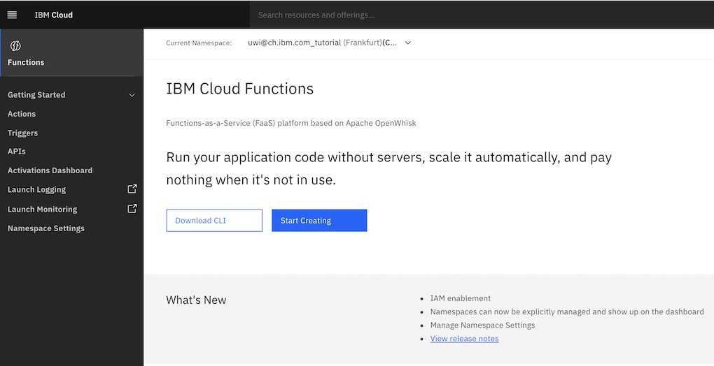

__Note__: The current namespace which is displayed after "Current namespace:"

__Note__: You can create a separate namespace for this tutorial by creating a new [cloud foundry org and space]( https://cloud.ibm.com/account/cloud-foundry). Ensure that you create your separate namespace in the same region as you have created the Event Streams Service in task 1) above. 

<h4>Task 11) Install the IBM Cloud Command Line with functions plugin</h4> 

[IBM Cloud Command Line](https://cloud.ibm.com/functions/cli)

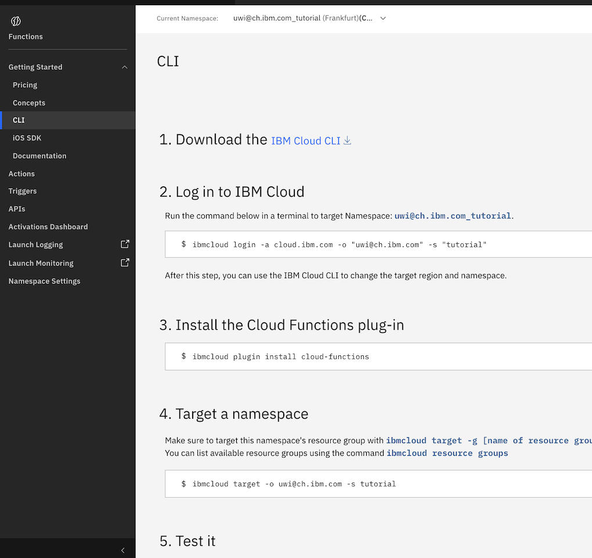

__Note__: Ensure that you target the same resource group as you have created the Event Stream Service in task 1) above. If you have left the value to its default then you would enter:

```shell
ibmcloud target -g default
```
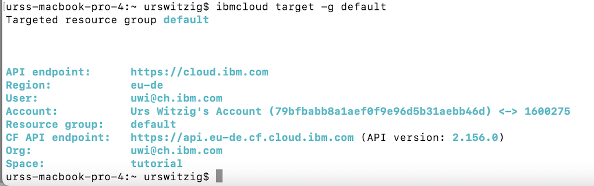

Test it

```shell
ibmcloud fn list
```

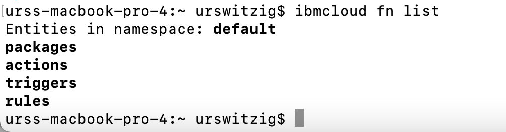


<h4>Task 12) Deploying the Event Streams Events template from the CLI</h4> 

IBM Cloud™ Functions offers a catalog of templates to help you get started on your next project. Templates are a combination of actions, triggers, sequences. Some templates also incorporate other services from IBM Cloud. By using these templates, you can understand how IBM Cloud™ Functions entities work together and even use these entities as a basis for your own project.

More information about the [quickstart templates]( https://cloud.ibm.com/docs/openwhisk?topic=openwhisk-templates#messagehub-events-template)

Clone the template repo.

    ```
    git clone https://github.com/ibm-functions/template-messagehub-trigger.git
    ```

Navigate to the directory for the action runtime that you want to use. For example, `python`.

    ```
    cd template-messagehub-trigger/runtimes/python
    ```
    

Deploy the template by using the following environment variables.

    ```shell
    KAFKA_BROKERS=<hosts> KAFKA_TOPIC=<topic> KAFKA_ADMIN_URL=<admin_url> \ 
    MESSAGEHUB_USER=<username> MESSAGEHUB_PASS=<password> \ 
    PACKAGE_NAME=<name> RULE_NAME=<name> TRIGGER_NAME=<name> \
    ibmcloud fn deploy -m manifest.yaml
    ```
    
   <table>
    <caption>Understanding the environment variables</caption>
    <thead>
    <th colspan=2>Understanding the environment variables</th>
    </thead>
    <tbody>
    <tr><td><code>KAFKA_BROKERS</code></td><td>Your Event Streams REST endpoints. See Service Credentials in task 4)</td></tr>
    <tr><td><code>KAFKA_TOPIC</code></td><td>The topic to subscribe to. In our tutorial "kafka-python-console-sample-topic"</td></tr>
    <tr><td><code>KAFKA_ADMIN_URL</code></td><td>The Event Streams admin URL. See Service Credentials in task 4)</td></tr>  
    <tr><td><code>MESSAGEHUB_USER</code></td><td>Your Event Streams username. See Service Credentials in task 4). In our case "token"</td></tr>
    <tr><td><code>MESSAGEHUB_PASS</code></td><td>Your Event Streams password. See Service Credentials in task 4).</td></tr>
    <tr><td><code>PACKAGE_NAME</code></td><td>A custom name for the package. In our tutorial "kafka-template-package-01"</td></tr>
    <tr><td><code>RULE_NAME</code></td><td>A custom name for the rule. In our tutorial "tutorial-write-rule-01"</td></tr>
    <tr><td><code>TRIGGER_NAME</code></td><td>A custom name for the trigger. In our tutorial "tutorial-write-trigger-01"</td></tr>
    </tbody>
   </table>

Example deployment
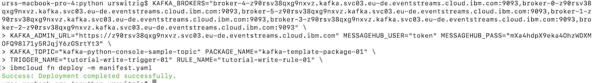   
    

List the entities you have deployed in your namespace

   ```shell
   ibmcloud fn list
   ```
   
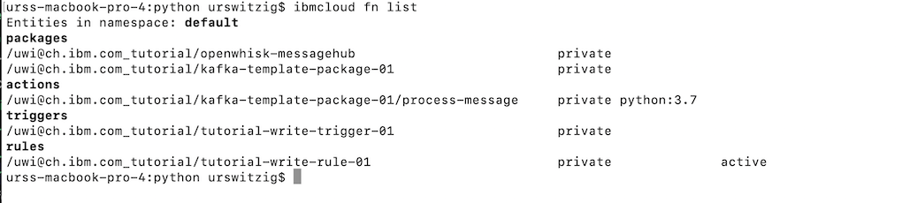

List the details of the trigger you deployed

   ```shell
   ibmcloud fn trigger get tutorial-write-trigger-01
   ```
   
List the details of the rule you deployed

   ```shell
   ibmcloud fn rule get tutorial-write-rule-01
   ```

<h4>Task 13) Produce messages with the standalone sample application in a separate command line window</h4> 

Open an separate command line window and run the standalone sample application to produce messages as outlined in task 8)

Produce messages
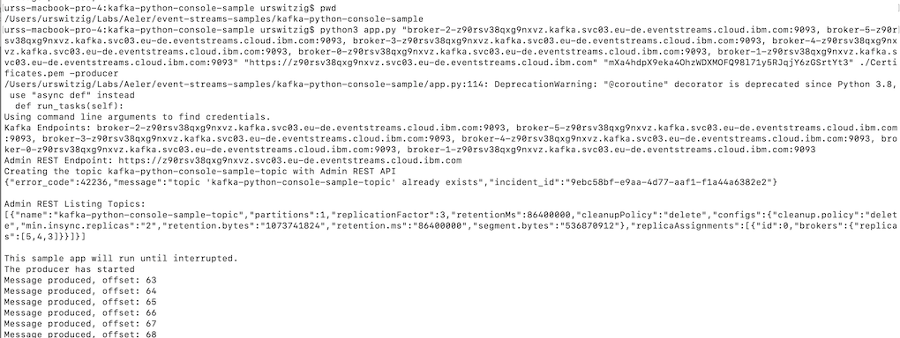 


<h4>Task 14) Poll the IBM functions activation logs</h4> 

Switch back to the command line window you used in task 12) where you deployed the Event Streams template

Poll the activation logs to see whether the incoming message trigger the process-message function

   ```shell
   ibmcloud fn activation poll
   ```
   
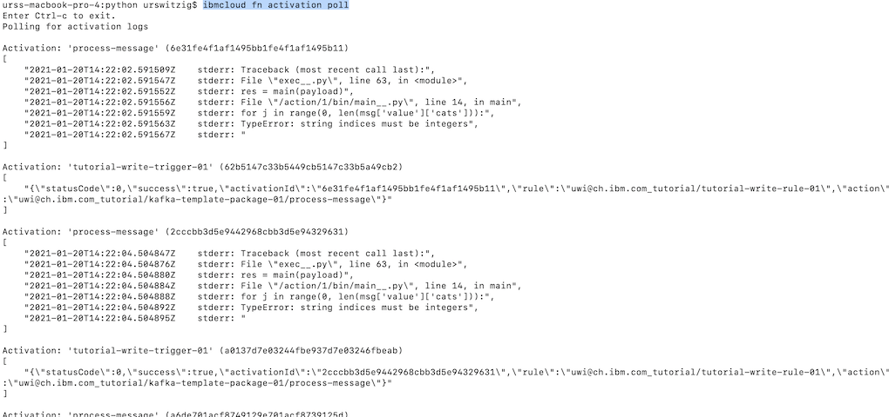 

We can see that the prossess-message function is activated each time a message arrives in the topic.
<br>
We see that the process-message function produces an error as it is expecting another message format than the one that was produced.

<h4>Task 15) Modify the process-message function</h4>

Change to the directory where you have downloaded the template-messagehub-trigger in task 12) 

   ```shell
   cd template-messagehub-trigger/runtimes/python
   ```
 Open the file actions/process-message.py file with an editor
 
   ```shell
   vi actions/process-message.py 
   ```
   
Delete the existing content and replace it by the following one:

   ```shell
   def main(dict):
    messages = dict.get('messages')

    if messages is None or messages[0] is None:
        return { 'error': "Invalid arguments. Must include 'messages' JSON array with 'value' field" }
    try:
        val = messages[0]['value']
    except KeyError:
        return { 'error': "Invalid arguments. Must include 'messages' JSON array with 'value' field" }

    for msg in messages:
        print(msg)
        
    return { 'msg': msg}
   ```
 
 Save the file
 
 Deploy the modified template as you did in task 12)

    ```shell
    KAFKA_BROKERS=<hosts> KAFKA_TOPIC=<topic> KAFKA_ADMIN_URL=<admin_url> \ 
    MESSAGEHUB_USER=<username> MESSAGEHUB_PASS=<password> \ 
    PACKAGE_NAME=<name> RULE_NAME=<name> TRIGGER_NAME=<name> \
    ibmcloud fn deploy -m manifest.yaml
    ```
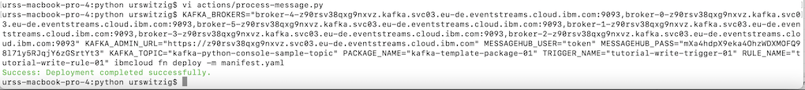

<h4>Task 16) Produce messages with the standalone sample application in a separate command line window</h4> 

Open an separate command line window and run the standalone sample application to produce messages as outlined in task 8)

Produce messages
 

<h4>Task 17) Poll the IBM functions activation logs</h4> 

Switch back to the command line window you used in task 12) where you deployed the Event Streams template

Poll the activation logs to see whether the incoming message trigger the modified process-message function

   ```shell
   ibmcloud fn activation poll
   ```
   
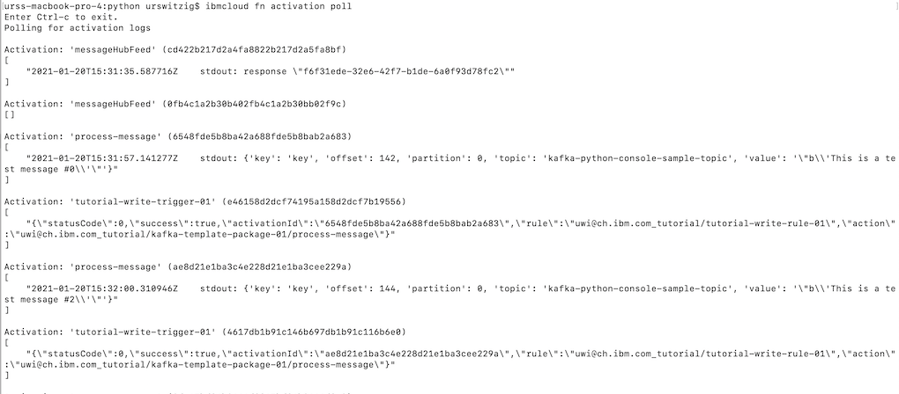 

We can see that the prossess-message function is activated each time a message arrives in the topic.
<br>
We see the modified process-message function running without error.
