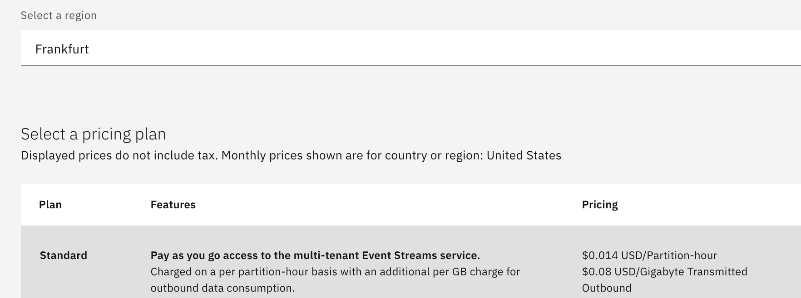

<h1 align="center" style="border-bottom: none;">:rocket: IBM Cloud Tutorial: Kafka and functions</h1>

In this hands-on tutorial you will create an IBM Event Streams Service on the IBM Cloud and run the sample application to produce events on the topic "kafka-python-console-sample-topic". Using IBM functions you create a trigger that invokes the write function every time an event arrives in the topic "kafka-python-console-sample-topic".

## Tutorial Overview

## Prerequisites

1. Sign up for an [IBM Cloud account](https://cloud.ibm.com/registration).
2. Fill in the required information and press the „Create Account“ button.
3. After you submit your registration, you will receive an e-mail from the IBM Cloud team with details about your account. In this e-mail, you will need to click the link provided to confirm your registration.
4. Now you should be able to login to your new IBM Cloud account ;-) 

## Create and configure Event Streams on the IBM Cloud

<h4>1) Create a Event Streams Service</h4>
After the login you will see your IBM Cloud Dashboard. In the upper right click on blue area "Create Resource". Type "Event Streams" in the search field of the catalog, then click on Event Streams. On the next page select the Lite - or the Standard plan and you can also choose a region, where you would like to deploy your service as well as a service name. Click "Create".

 
<h4>2) Access your Watson Assistant Service</h4>
Go back to your IBM Cloud Dashboard by clicking the IBM Cloud Logo on the upper left. Under services you will find the Watson Assistant Service in the corresponding region. Access your service by launching it. Afterwards click on Skills in the menu on the left and create a new Dialog skill. You have to set the language of your assistant or chatbot.

## Create Intents, Entities and the Dialog

The next step is to build your conversation. You can choose to build a customer service assistant, an assistant for your E-commerce, a company internal assistant or any other chatbot application of your choice. The three elements to consider are Intents, Entities and the Dialog.
<ul>
  <li><strong>Intents</strong> define a user's goal or purpose. Per intent you can configure various user examples. An example of an intent could be #Price and user examples could be “How much does it cost?” and “What is the price?”</li>
<li><strong>Entities</strong> handle significant parts of an input that should be used to alter the way the assistant responds to the intent. An example of an entity could be @products with the entity values “juice” and “water”.</li>
<li><strong>Dialog</strong> consists of dialog nodes. Each node is made up of a trigger (condition) and a response. If the assistant recognizes the intent #Price, it could then respond: Would you like to know the price of juice or water? Otherwise, if the assistant recognizes the intent #Price and the entity value @products is juice, it could then respond: The price of juice is 2€ per bottle.</li>
</ul>
If you see something called "Actions" instead of Intents, Entities and Dialog, you can switch to the standard UI, by doing the following:

